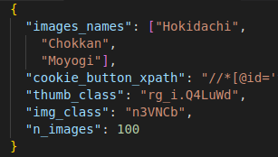

# ***Google's images web-scraper***


This web scraper was developed for gathering images of bonsai, you can find the dataset at:

***Kaggle*** -> coming soon

## ***Contents***

- [Setup](#set)
- [Configuration](#conf)
- [Run program](#run)

---

<a id='set'></a>
### ***Setup***
Before starting the program you need to install a few requirements like:
- [Google Chrome webdriver](#https://chromedriver.chromium.org/downloads) (for Selenium)

Then with:
```
pip install requirements.txt
```
You can install all the required python libraries, I recommend to create a [virtual environment](#https://www.geeksforgeeks.org/python-virtual-environment/) (Anaconda, pipenv, etc).

<a id='conf'></a>
### ***Configuration***
Here we can see how the ***configuration file*** ("data/scraper_config.json") look like:



You can change the number of images and obviously the type of images, fields like "thumb_class" and "img_class" are HTML tag needed to locate the elements on the web page.

<a id='run'></a>
### ***Run program***
From terminal:

```
python main.py
```
Or from the start button of your preferred IDE.

